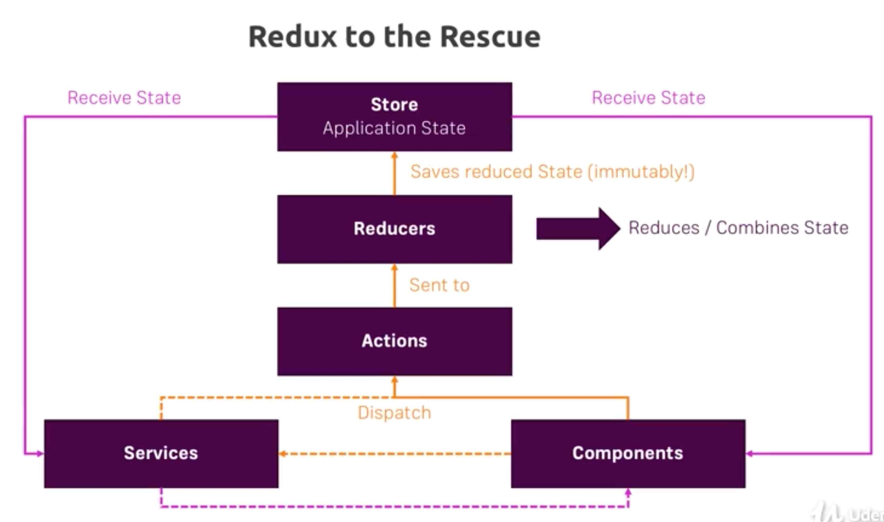
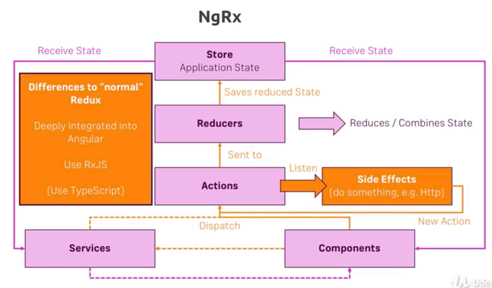
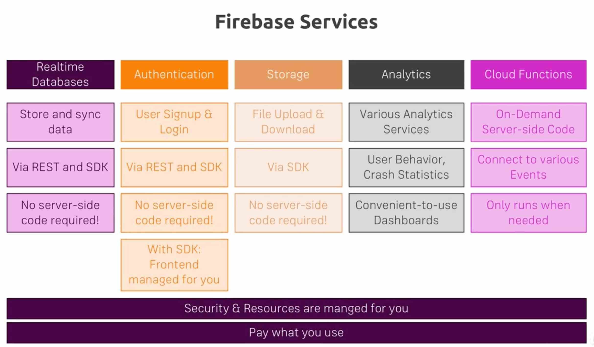

## [Angular CLI](https://cli.angular.io/)

```
npm install -g @angular/cli

ng new MY_PROJECT_NAME --prefix MY_PREFIX
ng serve -p 4300
ng build
```

https://github.com/angular/angular-cli
https://github.com/angular/angular-cli/wiki

https://augury.angular.io/

```
ng --help

ng generate component name              (ng g c name)
     --flat -is -it
     --inline-styles
     --inline-template
     --skipTests false

ng g module name

ng generate class recipe                (ng g cl recipe)
ng g directive name
ng g service name
ng g route name --lazy false

ng destroy component name
ng destroy component name --flat

ng lint
ng test

ng build -prod
ng build -prod --aot   (ahead of time - smaller final package size)

ng github-pages:deply  (public repo when creating a key)

ng test

ng update
```

npm install --save bootstrap

Modify .angular-cli.json to include it in styles section
    "../node_modules/bootstrap/dist/css/bootstrap.css"


## [schematics](https://angular.io/guide/schematics)
A tool for creating, modifying, and maintaining any software project. 
Supports adding new functionality, code generation, process of updating to the latest version.
For example - adding @angular/material to the Angular based project.  

- [Material Design](https://material.angular.io/)
    - ng add @angular/material

- Firebase
    - ng add @angular/fire
    
- Elements
    - ng add @angular/elements


## Libraries 
- Bootstrap
    - npm install --save bootstrap font-awesome
    - npm install --save @ng-bootstrap/ng-bootstrap

- Layout - flex
    - npm install --save @angular/flex-layout

- Lodash
    - npm install --save lodash
    - import * as _ from 'lodash'; 
    
- Moment
    - npm install --save moment @angular/material-moment-adapter


## [angular.json](https://angular.io/guide/workspace-config)
- we can add additional configurations - eg, beside dev and production and staging


## [browserslist](https://github.com/browserslist/browserslist)
Allows preparing different files for different browser. Smaller code bundle for modern browsers.
Check: Differential Loading


## [Testing](https://angular.io/guide/testing)


## Projects 
We can have a project with multiple subprojects.  

```
    ng new angular-shop --create-application=false
    ng generate application frontend
    ng generate application backend
    ng generate library my-components

    ng serve frontend
```
Check [Library](https://angular.io/guide/creating-libraries)
 

## Lifecycle:

- index.html loads main.ts
- loads app.module.ts
- loads app.component.ts


## Components:

```
@Component({
  selector: 'rb-component',
  template: `...`,
  templateUrl: './app.component.html',
  styleUrls: [...],
  styles: [``]
})
```

## Selectors

- selector: 'rb-component'          tag
- selector: '[rb-component]'        attribute
- selector: '.rb-component'         class


## Data binding methods:

- String interpolation      ```{{expression resolving to string}}```
- Property binding          ```<button [disabled]="expression">```
- Event binding             ```<button (click)="onClick($event)">```
- Two-Way data binding      ```<input [(ngModel)]="bind model">``` - combination of property and event binding
- ngModel directive requires FormsModule from @angular/forms

- [sth]="passing expression"
- sth="passing string only"


## Directives:
- attribute - interact with the element (ngClass, ngStyle)
- structural - interact with the current view container and change the structure of the DOM (ngIf, ngFor, ngSwitch)   
             - leading star, only one structural directive is allowed on a given element


## Pipes
- used to transform a value
- https://angular.io/api?type=pipe
- ``` {{ username | uppercase }} ```
- async pipe for Promises
- check the 'pure' parameter of a pipe


## Services:
- depending on the level of definition we can have a single or multiple instances of a service
- defining in AppModule we will use the same instance application-wide
- number of services that are created is determined by number of providers: [OurService]
- Angular6+ allows to skip adding services to providers, it also can improve performance as such services are lazy loaded 
    @Injectable({providedIn: 'root'})


## Cross-component communication:
- add a service with @Output EventEmitter, and in the listening component subscribe to it (better approach involves Subjects)


## Routing:
- app.modules.ts - ```RouterModule.forRoot(appRoutes)```
- ```<router-outlet></router-outlet>```
- children require their own ```<router-outlet></router-outlet>```
- main directives and services
    - routerLink
    - queryParams
    - fragment
    - routerLinkActive
    - routerLinkActiveOptions
    
    - Router            router.navigate(['edit', 1], {relativeTo, queryParams, fragment, queryParamsHandling})
    - ActivatedRoute    route.snapshot 
                        route.params.subscribe(), route.snapshot.params
                        route.queryParams.subscribe(), route.snapshot.queryParams
                        route.fragment.subscribe(), route.snapshot.fragment

- guards
    - CanActivate
    - CanDeactivate 
    - Resolve


## Observable

```
import {interval} from 'rxjs'
import {filter, map, skip} from "rxjs/operators";
```

Remember about unsubscribing! 


## Forms:
- template driven approach - Angular infers the Form object from the DOM
- reactive - Form is created programmatically and synchronized with the DOM
    - custom validators
    - async validator
    - dynamic form
    - reacting to change (subscriptions)
- [validators](https://angular.io/api/forms/Validators)


## Testing:
- ```ng test```
- https://angular.io/guide/testing
- https://semaphoreci.com/community/tutorials/testing-components-in-angular-2-with-jasmine


## Deployment
- ng build --prod --aot 
- check environments folder
- example.com/my-app      ```<base href="/my-app">```
- return index.html in case of 404 errors
- AWS S3 hosting https://docs.aws.amazon.com/AmazonS3/latest/dev/WebsiteHosting.html


## Modules
- allow to separate the coda and lazy load modules
- modules DO NOT cummunicate with each other
- options defined on route: NoPreloading, PreloadAllModules, or define own PreloadingStrategy
- a shared module to keep common elements
- CanLoad guard can be used to revoke access to a route and avoid loading unnecessary files


## Ahead Of Time Compilation (oposite to JIT)
- what's compiled is HTML which is turned into JS
- faster startup since parsing and compilation doesn't happen in Browser
- templates get checked during development
- smaller file size as unused features can be stripped out and the compiler itself isn't shipped


## Redux - ngRx library for Angular that provides Redux functionality
- npm install --save @ngrx/store
- npm install --save @ngrx/effects
- npm install --save @ngrx/router-store
- npm install --save @ngrx/store-devtools  + Chrome Redux DevTools extension
- Store keeps the Application State
- Services and Components have access to the Store, they can still communicate with each other
- to modify the state we dispatch Actions (eg. save a post)
- Actions are sent to Reducers are functions which take Actions and payload as input and prepare a new immutable state
- effects don't change the state of the app
- switchMap don't wrap with Observable
- https://blog.nrwl.io/using-ngrx-4-to-manage-state-in-angular-applications-64e7a1f84b7b
- https://blog.nrwl.io/ngrx-patterns-and-techniques-f46126e2b1e5






## Firebase
- https://github.com/angular/angularfire2/blob/master/docs/install-and-setup.md
- npm install angularfire2 firebase --save

- Firestore is a document db (like mongoDB) - collections and documents

- constructor(private db: AngularFirestore) {}
- valueChanges returns import {Observable} from 'rxjs/Observable'; doesn't include id (key) 
- this.db.collection('ng-fitness_available-exercises').valueChanges().subscribe((r) => {});

- snapshotChanges returns import {Observable} from 'rxjs/Observable'; includes id (key)

- this.db.collection('ng-fitness_finished-exercises').add(exercise)

- this.db.doc('ng-fitness_finished-exercises/' + id).update({lastUpdated: new Date()})




## Service Worker

- a proxy between the app and the server
- can cache the responses/requests


## Libs:
- (!!!) https://github.com/brillout/awesome-angular-components
- Drag&Drop: https://github.com/akserg/ng2-dnd

